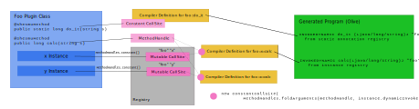

# `MethodHandles` for life-cycle management in Shesmu

At the Ontario Institute for Cancer Research, we decide when to run data analysis workflows based on metadata about previous analysis coupled with patient data. To coordinate that, I build [Shesmu](https://oicr-gsi.shesmu.github.io/) which runs SQL-like programs that select and filter that metadata and create _actions_ that go into a scheduler. For the purpose of this discussion, how the programs are structured and how the scheduler works aren't very relevant. The important part is this: the way that Shesmu programs process data depends heavily on the environment and the Shesmu language is, intentionally, very limited in what it can do. To make the programs useful, a Shesmu server has a lot of plugins and configuration files that make definitions available to those programs.

For a typical deployment, one would deploy the core Shesmu server, a set of plugins (which are Java code), and a directory of configuration files for the plugins. For instance, there is a plugin for interfacing with [Víðarr](https://oicr-gsi.github.io/vidarr/), another in-house service, and that plugin will read any `.vidarr` from the configuration directory and connect to a Víðarr server specified in the configuration. Both development and production Shesmu servers would have the same Java code, but different configuration files and therefore connect to two different Víðarr servers. The Shesmu server can then compile any programs it finds in the configuration directory that might use definitions exported by the plugins. As a concrete example, if a server was configured with a `foo.vidarr` configuration file, then the programs could use the function `vidarr::foo::workflow_run_info`. In effect, the plugins are providing most of the “library” functions that Shesmu programs use.

The Shesmu compiler needs to emit _something_ that will bind to that method and there are two problems: the plugin methods are not static, they are bound to instances of particular plugins (based on what the server finds on disk) and the plugin's configuration might be deleted or recreated. To make that possible, the Shesmu compiler uses the `INVOKEDYNAMIC` and `MethodHandle` infrastructure on the JVM.

There are many descriptions of method handles, but that's not going to stop me from re-explaining. Let's roll back to C for a moment. There are two ways to call a function in C: a regular function call or calling a function pointer. The C compiler will generate two different CPU instructions for those two cases: the first with a hard-coded address and the second with an address loaded from a register or wherever. In Java...life is more complicated. Java has a few different kind of call instructions: `INVOKESTATIC` for calling static methods, `INVOKEVIRTUAL` for calling instance methods of classes, `INVOKEINTERFACE` for doing the same thing as `INVOKEVIRTUAL` but for interfaces, and `INVOKESPECIAL` for calling constructors and `super` methods. In C, the call instruction has the address of a function or the register that contained the address of the function. Again, Java is more complicated. For static methods, constructors, and final instance methods, the JVM could figure out a single address to call; for everything else, not so much. The JVM has to build a data structure to keep track of what code it should call for each of those `INVOKE` instructions and it might change when new classes are loaded.

At some point, the JVM developers were interested in supporting other languages on the JVM which often had calling semantics that were very different from Java's. So, a new instruction `INVOKEDYNAMIC` was created to allow the compiler to figure out what to call later and update it as required. That data structure of what can actually be called is a _method handle_ and the instruction that references it is called the _call site_. Beyond method handles that correspond to the `INVOKE` instructions, there are also method handles to return constants, throw exceptions, access arrays, access fields, and mix and match all these pieces. This was intended so that, in a dynamic language such as Python or Ruby, as new possible subtypes are discovered or created, a call can be expanded to include new behaviours. In Shesmu, I exploit this to marry the plugins and programs together.

Plugins can export definitions to Shesmu programs three ways: annotations on static methods, annotations on instance methods, and dynamically using callbacks. Each of these is handled slightly differently, though some server infrastructure is managing all of the plugin state in a related way. When Shesmu starts up, it scans for plugins using `ServiceLoader` and then uses the reflection APIs to look for annotations on the plugin classes. It takes an annotated static methods, creates a method handle for these, and puts a definition into the compiler's library. It takes the annotated virtual methods and also creates method handles for those, but puts them in a separate list, not accessible to the compiler.

When the server detects a new configuration file, it finds an appropriate plugin and creates a new instance for it. It names the instance based on the file name. While the file names aren't guaranteed to be unique (the server can scan multiple directories), any administrator who does that is in for a world of hurt, so Shesmu pretends they are unique. It passes the plugin a [`Definer`](https://github.com/oicr-gsi/shesmu/blob/master/shesmu-pluginapi/src/main/java/ca/on/oicr/gsi/shesmu/plugin/Definer.java) instance that allows the plugin to register new definitions that are connected to callbacks. The plugin manager will make the definitions registered using the `Definer` plus any annotated virtual methods available to the compiler. If the configuration file is deleted, the server will remove these from the compiler.



Most of the heavy lifting is done in [PluginManager](https://github.com/oicr-gsi/shesmu/blob/5181c90b56ec48d0f1843ce50af19aa4d43608f8/shesmu-server/src/main/java/ca/on/oicr/gsi/shesmu/server/plugins/PluginManager.java), but I will include simplified samples here, mostly to avoid some of the intricacies of the Shesmu language. For instance, Shesmu doesn't have zero-argument functions (_e.g._, `foo()`) and it turns these into “constants”, and there is a bunch of code that sorts this out. Also, Shesmu has a number of special constructs that are mapped onto Java classes with complicated interfaces that aren't particularly relevant to the way it uses method handles.

If a program uses an annotated static method, it emits an `INVOKEDYNAMIC` instruction that gets the appropriate method handle from singleton map in the server. Since Java doesn't have the functionality to remove the plugin's loaded classes, there's no possibility or need to de-register or change these methods. A `ConstantCallSite` is emitted for these since these definitions cannot change. Shesmu uses the reflection API to create a method handle using the [`MethodHandles.Lookup.unreflect`](https://github.com/oicr-gsi/shesmu/blob/5181c90b56ec48d0f1843ce50af19aa4d43608f8/shesmu-server/src/main/java/ca/on/oicr/gsi/shesmu/server/plugins/PluginManager.java#L1238) to get a `MethodHandle` for the method it discovered with an annotation. It then creates a [definition](https://github.com/oicr-gsi/shesmu/blob/5181c90b56ec48d0f1843ce50af19aa4d43608f8/shesmu-server/src/main/java/ca/on/oicr/gsi/shesmu/server/plugins/PluginManager.java#L129) the compiler can consume. The definition places the method handle in the registry and knows how to generate an appropriate `INVOKEDYNAMIC` instruction. There is a bunch of wrangling between type systems in this code. The Java APIs use `Class` for representing types, while the ASM library used to generate the bytecode use `Type`, and Shesmu represents its type system as `Imyhat`. As much as possible, Shesmu keeps type information in its own format, and then converts it to JVM and ASM type information when necessary.

For definitions tied to an instance, things are a bit trickier. The values registered by `Definer` are the simpler of the two. Like the annotated static method, there is a singleton map in the server. However, since plugins may go away, this map does not point to `ConstantCallSite`, but `SoftReference<MutableCallSite>` (implemented as [`CallSiteRegistry`](https://github.com/oicr-gsi/shesmu/blob/master/shesmu-server/src/main/java/ca/on/oicr/gsi/shesmu/server/plugins/CallSiteRegistry.java)). When the plugin registers a new definition, it will be included in the map and in a list that is exported to the compiler. The compiler will emit an `INVOKEDYNAMIC` instruction that will bind to one of these mutable call sites. As long as at least one of program or the plugin is maintained, the soft reference in the map will contain a mutable call site. If either goes through a life cycle event where it is destroyed, garbage collected, and re-created anew, it will still be connected to the same mutable call site instance, allowing the plugin to update the definition at will.

The `Definer` interface uses callbacks from the Java standard library, including `Supplier`, `Function`, and `BiFunction`, and ones unique to Shesmu. There is a [static intializer](https://github.com/oicr-gsi/shesmu/blob/5181c90b56ec48d0f1843ce50af19aa4d43608f8/shesmu-server/src/main/java/ca/on/oicr/gsi/shesmu/server/plugins/PluginManager.java#L1690) that get method handles for the appropriate method in each of these interfaces (_e.g._, `Function::apply`) and stores these. When the `Definer` is used, for example [`defineFunction`](https://github.com/oicr-gsi/shesmu/blob/5181c90b56ec48d0f1843ce50af19aa4d43608f8/shesmu-server/src/main/java/ca/on/oicr/gsi/shesmu/server/plugins/PluginManager.java#L609), a `MethodHandle` is created as follows:

```
final var handle =
    MH_FUNCTION_APPLY
        .bindTo(function)
        .asType(
            MethodType.methodType(
                returnType.type().javaType(), parameterType.type().javaType()));
```

The `MH_FUNCTION_APPLY` is the handle for `Function::apply`. Although `apply` takes only one parameter, `MH_FUNCTION_APPLY` takes two: the instance of the function and the parameter. The `bindTo` fills in this instance parameter with the `function` callback provided by the plugin. Because of differences erasure in `Function`, this handle is then manipulated to the correct types for both the parameter and return types.

This can then be put in the registry. The bootstrap method is very simple as it can just pull the matching method from the registry and use it. There are also some definitions created for the compiler to consume to know that this function exists and how to generate code for it.

There is one small wrinkle: type erasure. The Shesmu language has similar erasure behaviour to Java and a plugin could redefine a function that used to return `Set<Long>` to return `Set<String>` and we wouldn't want to use the updated callback in the program. To avoid this the name of a definition in the singleton map includes the type signature. It's effectively C++ name mangling all over again. Working and pretty aren't the same thing.

In normal uses of `INVOKEDYNAMIC` each `CallSite` is associated with one `INVOKEDYNAMIC` because each function call might call different methods in the programs object structure. Shesmu is, fundamentally, a static language. Unlike, say Python, where `x.foo().foo()` could be calling two different methods for `.foo()`, in Shesmu, `foo(foo(x))` will be exactly the same call for both, so the call sites are reused since all calls will be the same. Shesmu does not have generic types, so there are _no_ structural differences between those two calls.

For annotated virtual methods, the approach is similar: there is a single map of `SoftReference<MutableCallSite>` containing a call site which returns an instance of the plugin. When the compiler needs to create an `INVOKEDYNAMIC` for one of these definitions, it creates a constant call site containing the mutable reference to provide the instance of the plugin, which can be changed, and the virtual method invocation, which is fixed. In essence, it treats the method call itself like the static case and the plugin instance like the callback case.

Most of the [code that handle instances methods](https://github.com/oicr-gsi/shesmu/blob/5181c90b56ec48d0f1843ce50af19aa4d43608f8/shesmu-server/src/main/java/ca/on/oicr/gsi/shesmu/server/plugins/PluginManager.java#L1126) is a little hairy, so let's break it down.

```
private DynamicInvoker installMethod(Method method,
                                     String prefix,
                                     Class<?> returnType)
    throws IllegalAccessException {
```
The `method` is the one obtained from using reflection; `prefix` is an arbitrary string Shesmu uses to disambiguate what kind of language construct this method is associated with and really doesn't matter; `returnType` is usually null but provided to do some generic erasure trickery with the details to follow. The return type `DynamicInvoker` is an internal interface that the compiler uses for generating bytecode--details to follow.

First, we figure out the registry name and obtain a method handle.

```
final var mangledMethodName = prefix + method.getName();
var handle = fileFormat.lookup().unreflect(method);
```

The Java implementations of some Shesmu language features use Java inheritance, so the JVM code handles an supertype type. When that occurs, the supertype is provided as `returnType` and the method handle should be modified to cast the return type. The design of Shesmu is constrained so this will only ever happen on return types; otherwise we might need similar logic for parameter types.

```
  if (returnType != null) {
    handle = handle.asType(handle.type().changeReturnType(returnType));
  }
```

The method handle has a parameter for the instance of the plugin as the first argument to the method. However, when we finally emit the bytecode for that, it will _not_ be provided by the compiler. The bootstrap method will insert the appropriate instance, so we generate the method descriptor without the receiver.

```
  final var methodDescriptor =
      handle.type().dropParameterTypes(0, 1).toMethodDescriptorString();
```

Finally, we put this method handle in the registry.

```
  CONFIG_FILE_METHOD_BINDINGS.put(
      new Pair<>(fileFormat.fileClass(), mangledMethodName), handle);
```

We then return a way for the compiler to generate the bytecode for this instruction. This will be a kind of “template” we can marry with the instance of a plugin. So, the compiler provides `methodGen`, the place where it is writing bytecode, and `path`, the identifier for the instance and connects it to the bootstrap method.

```
  return (methodGen, path) ->
      methodGen.invokeDynamic(mangledMethodName,
                              methodDescriptor,
                              BSM_HANDLE,
                              path);
}
```

Let's look at the [bootstrap method](https://github.com/oicr-gsi/shesmu/blob/5181c90b56ec48d0f1843ce50af19aa4d43608f8/shesmu-server/src/main/java/ca/on/oicr/gsi/shesmu/server/plugins/PluginManager.java#L1731) to see what happens when it is time to resolve this `INVOKEDYNAMIC` instruction. This is the most documented method I have ever written.

```
  public static CallSite bootstrap(
      Lookup lookup, String methodName, MethodType methodType, String fileName) {
```
The parameter `lookup` is provided automatically by the JVM. `methodName` is the `mangledMethodName` from above and `methodType` is equivalent to `methodDescriptor`. Finally, `fileName` is a custom addition to the bootstrap method and will be the parameter `path`.


We're going to build our call site in two parts.

First, we get a call site that contains a method handle that just returns the instance associated with our configuration file. That file might be deleted or updated, so we will keep that instance as a soft reference. If the olive using it is garbage collected and the file is deleted, this will drop out of the map. Otherwise, if the file is updated, it can change the instance in the call site and all the olives will use the new one.

```
final var instance = CONFIG_FILE_INSTANCES.get(fileName);
```

For the method, we know the type of the thing in the call site, so let's go find a method that can handle it in our cache. We cache these forever because they can't be created or destroyed without reloading the whole server.

```
final var methodHandle = CONFIG_FILE_METHOD_BINDINGS.get(
    new Pair<>(instance.type().returnType(), methodName));
```

Now we smash the instance from above with the method. We can create a constant call site (_i.e._, one that can't be updated) because the method called will never change but the instance is referenced through it's mutable call site, so we can update the instance.

```
  return new ConstantCallSite(
      MethodHandles.foldArguments(methodHandle, instance.dynamicInvoker()));
}
```

The use of `SoftReference` is a bit confusing and a key part of what makes this reliable. The Shesmu programs and the plugins are living different life cycles. As the server is running, new programs and plugin instances may get added, they may be modified, and they may be deleted. The goal is to gracefully allow this to happen and still permit the garbage collector to clean up anything that truly becomes garbage in a long-running server.

If a plugin instance is unregistered while a program is using it, the program will keep that plugin instance alive until either the program is removed and both are garbage collected or a replacement plugin instance comes online. Part of the Shesmu design is that everything should keep on trucking with the last known good state wherever possible. This half-broken state might sound like an uncommon occurrence, but it is sadly common with git-ops. OICR manages the configuration using git and the servers pulls from a git repository containing the files. While git is updating, it transiently deletes files that have changed contents. This design ensures that no running Shesmu programs are affect and all of them will quickly get the new state once it is available. This also gives an administrator a grace period to fix a broken configuration without downtime.

The use of `SoftReference` in the `CallRegistry` is what lets this work. If either the plugin or program, the `SoftReference` will persist in the match and the other side can associate with it again. Once the plugin and program are gone, the whole thing can be cleaned up by the JVM.

Unlike most programming languages, this does means that Shesmu compile errors are possibly transient. Especially during server start up, plugins may take some time to expose definitions, so programs will fail to compile. The server will reattempt to compile failed programs every few minutes to check if new definitions are available. In this way, Shesmu fulfills every programmer's dream of “maybe it will compile this time even though I haven't changed anything.”
